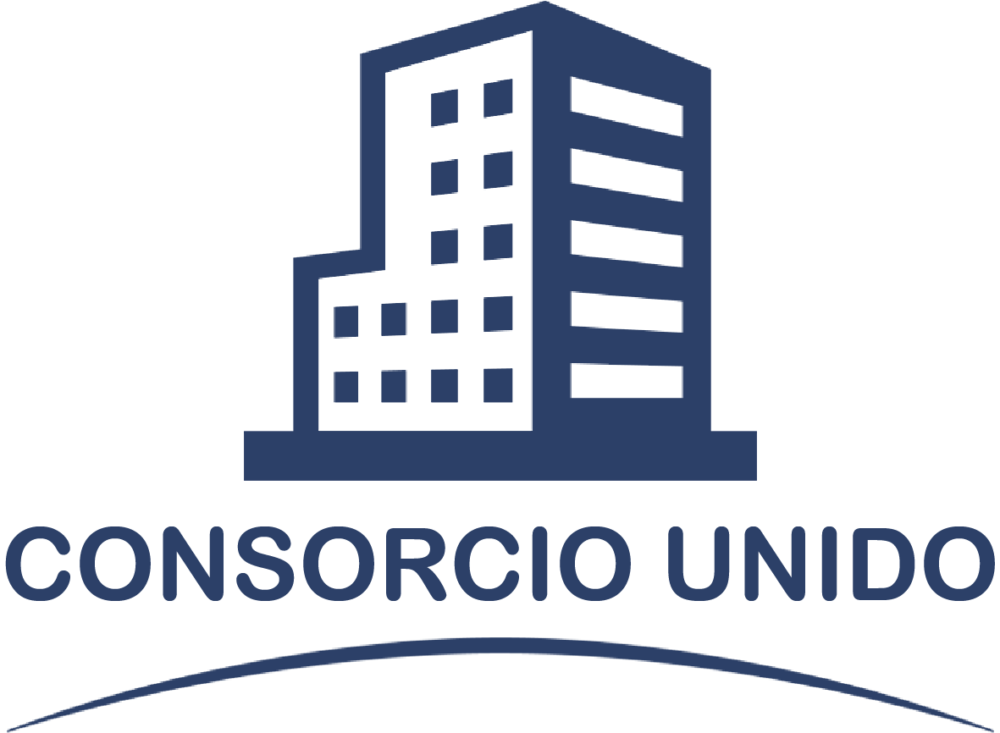

# Consorcio Unido

Consorcio Unido es una aplicación que busca mejorar la comunicación entre la administración del consorcio y los vecinos.

La idea principal es garantizar las transparencia de cada una de las acciones que ocurran en un consorcio como ser

* Gastos comunes.
* Gastos particulares.
* Detalles de pagos y morosidad.
* Notificaciones generales.
* Comunicacion directa con la administracion.

## Como lo hace?
Para garantizar la transparencia Consorcio Unido facilita la carga de información y comprobantes de gastos. 
Brinda a los miembros del consorcio una vista clara de los gastos que le corresponde abonar, cuales son los gastos generales y cual es la situacion de pago de cada uno de los miembros para evitar especulaciones.
Ademas brinda un tablero en el cual la administracion podra enviar notificados generales de manera que sea accesible para todos los miebros y sea informacion que este siempre disponible.

Si te interesa estar al tanto del desarrollo de la aplicación podes hacerlo desde nuestro [Tablero de avances del proyecto](https://trello.com/b/8gd8AhAh/consorciounido).
